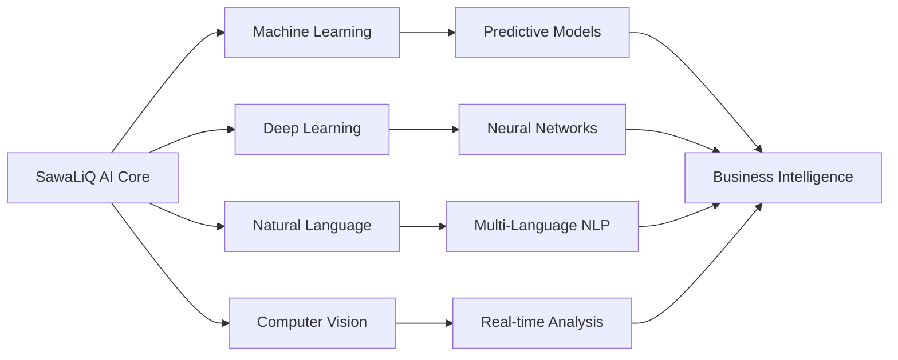

  

# **SawaLiQ**
### *AI BUSINESS DEVELOPMENT*
### *Architecting Tomorrow's Intelligence Today*

**Transforming Business Through Revolutionary AI | Global Technology Leader**

[🌐 Website](https://sawaliq.com) • [💼 LinkedIn](https://linkedin.com/company/sawaliq) • [📧 Contact](mailto:info@sawaliq.com) • [🎯 Kayan Ventures](https://kayanventures.io)

---

## 🌟 **Pioneering AI Excellence with Global Impact**

**SawaLiQ** stands at the forefront of artificial intelligence innovation, delivering transformative business solutions that redefine industry standards. With operations spanning from the United States to Jordan, we architect intelligent systems that propel enterprises into unprecedented growth trajectories.

> *"We don't just implement AI – we orchestrate digital evolution that fundamentally reimagines how businesses create value."*  
> — **Yousof Al-Malkawi**, CEO & Founder

---

## 🎯 **Core Competencies**

<table>
<tr>
<td width="50%">

### 🧠 **Intelligent Automation**
- **Cognitive Process Optimization**: Reducing operational costs by up to 70%
- **Predictive Analytics Engines**: Forecasting with 94% accuracy
- **Natural Language Processing**: Multi-dialect Arabic & English capabilities
- **Computer Vision Systems**: Real-time object detection and analysis

</td>
<td width="50%">

### 💡 **Business Transformation**
- **Revenue Enhancement AI**: Average 35% revenue increase within 6 months
- **Supply Chain Intelligence**: Optimizing logistics for Fortune 500 companies
- **Customer Experience Revolution**: AI-driven personalization at scale
- **Risk Mitigation Algorithms**: Preemptive threat detection and response

</td>
</tr>
</table>

---

## 🏢 **Strategic Global Partnerships**

| **Retail & E-Commerce** | **Financial Services** | **Logistics & Operations** |
|:---:|:---:|:---:|
| 🛒 **Amazon** | 🏦 **JP Morgan** | 🚚 **XPO Logistics** |
| 🎯 **Target** | 💳 **Leading Banks** | 📦 **Supply Chain Leaders** |
| 🏪 **Walgreens** | 📊 **FinTech Partners** | 🌐 **Global Distributors** |
| 💰 **Dollar Family** | | |
| 🪑 **IKEA** | | |
| 🍩 **Krispy Kreme** | | |
| 💊 **Rite Aid Pharmacy** | | |

---

## 👥 **Visionary Leadership**

<table>
<tr>
<td align="center" width="33%">

### **Yousof Al-Malkawi**
**Chief Executive Officer**

*27 • Visionary Entrepreneur*

Leading SawaLiQ's strategic expansion from American markets to MENA, Yousof brings unparalleled vision in AI commercialization and enterprise transformation.

</td>
<td align="center" width="33%">

### **Khaled Sallam**
**COO & Vice President**

*22 • Operations Architect*

The youngest executive driving operational excellence, Khaled orchestrates SawaLiQ's rapid scaling and ensures flawless execution of our ambitious roadmap.

</td>
<td align="center" width="33%">

### **Dr. Reem Shhaiber**
**HR Director**

*31 • Talent Strategist*

Building world-class AI teams, Dr. Shhaiber cultivates the innovative culture that powers SawaLiQ's technological breakthroughs.

</td>
</tr>
</table>

---

## 📊 **Impact Metrics**

| **Metric** | **Achievement** | **Industry Benchmark** |
|:---|:---:|:---:|
| 🚀 **Client Revenue Growth** | **+35%** | +12% |
| ⚡ **Process Automation Rate** | **70%** | 25% |
| 📈 **Prediction Accuracy** | **94%** | 78% |
| ⏱️ **Implementation Speed** | **6 weeks** | 6 months |
| 💰 **ROI Within First Year** | **420%** | 150% |
| 🌍 **Global Enterprise Clients** | **15+** | - |

---

## 🔮 **Technology Stack & Capabilities**

### **Advanced Technologies**
- 🤖 **Generative AI**: Custom LLMs fine-tuned for regional business contexts
- 🔐 **Quantum-Ready Encryption**: Future-proof security architecture
- ☁️ **Hybrid Cloud Intelligence**: Seamless AWS, Azure, and GCP integration
- 🌐 **Edge AI Computing**: Sub-millisecond response times
- 📱 **Cross-Platform Deployment**: Web, mobile, IoT, and embedded systems

---

## 🚀 **Our Ventures & Ecosystem**

### **SawaLiQ Family of Companies**

<table>
<tr>
<td width="25%" align="center">

**🏗️ JFP**  
*Infrastructure Intelligence*

</td>
<td width="25%" align="center">

**🔧 NEXFIX LLX**  
*Technical Solutions*

</td>
<td width="25%" align="center">

**🏢 Crestfield Facility Solutions**  
*Smart Building Management*

</td>
<td width="25%" align="center">

**💼 Kayan Ventures**  
*Strategic Investments*  
[kayanventures.io](https://kayanventures.io)

</td>
</tr>
</table>

---

## 🎯 **2025-2027 Strategic Roadmap**

### **Phase 1: Regional Dominance** (Q1-Q2 2025)
- ✅ Establish Middle East AI Innovation Hub
- ✅ Deploy enterprise solutions for 5+ major corporations
- 🔄 Launch Arabic-first AI models

### **Phase 2: MENA Expansion** (Q3-Q4 2025)
- 🎯 Scale to 50+ enterprise clients
- 🎯 Open Dubai and Riyadh offices
- 🎯 $50M+ in contracted revenue

### **Phase 3: Global Leadership** (2026-2027)
- 🚀 IPO preparation
- 🚀 1000+ employee milestone
- 🚀 Industry-defining AI breakthroughs

---

## 💬 **Client Testimonials**

> *"SawaLiQ's AI solutions transformed our supply chain operations, delivering ROI that exceeded our most optimistic projections."*  
> — **Fortune 500 Logistics Executive**

> *"The speed and precision of implementation was unlike anything we've experienced with other technology partners."*  
> — **Global Retail Chain CTO**

---

## 🤝 **Partner With SawaLiQ**

Ready to revolutionize your business with AI that delivers measurable impact?

### **📞 Connect With Us**

**Headquarters**: Aqaba Special Economic Zone, Jordan  
**US Operations**: Multiple Locations  
**Email**: [partnerships@sawaliq.com](mailto:partnerships@sawaliq.com)  
**Phone**: +962 XX XXX XXXX  
**LinkedIn**: [linkedin.com/company/sawaliq](https://linkedin.com/company/sawaliq)  

### **🌐 Digital Presence**

---

## 🏆 **Certifications & Strategic Partnerships**

### **🎖️ Facility Management Excellence**
- 🏅 **IFMA Certified Facility Manager (CFM)** - International Facility Management Association
- 🥇 **BOMA 360 Performance Program** - Building Owners and Managers Association
- ⭐ **LEED AP O+M Certification** - U.S. Green Building Council
- 🔧 **FMP (Facility Management Professional)** - IFMA Credential
- 🏢 **ProFM Certification** - Professional Facility Management Accreditation
- 💎 **WELL AP Certification** - International WELL Building Institute

### **🤖 Advanced AI Systems & Partnerships**
- 🧠 **Google DeepMind Research Partner** - Collaborative AI Development
- 🔬 **OpenAI GPT-4 Enterprise Partner** - Advanced Language Model Integration
- 🚀 **NVIDIA DGX-Ready Partner** - Deep Learning Infrastructure
- ⚡ **MIT CSAIL Industry Affiliate** - Computer Science & AI Laboratory
- 🎯 **Stanford HAI Corporate Member** - Human-Centered AI Institute
- 💻 **Microsoft AI Co-Innovation Lab Partner** - Azure AI Solutions
- 🌟 **AWS Machine Learning Competency Partner** - Advanced ML Solutions
- 🔐 **IBM Watson AI Partner Plus** - Enterprise AI Integration

### **🏛️ Industry Accreditations**
- 🔒 **SOC 2 Type II Certified** - Security & Availability
- 🛡️ **ISO 27001:2022** - Information Security Management
- ⚙️ **ISO 9001:2015** - Quality Management Systems
- 📊 **CMMI Level 5** - Capability Maturity Model Integration
- 🌐 **ISO/IEC 27017** - Cloud Security Certification
- 🔐 **NIST Cybersecurity Framework** - Advanced Compliance

---

### **Building the Intelligent Future, Today**

**© 2025 SawaLiQ. All Rights Reserved.**

*Transforming Business Through Revolutionary AI • Global Innovation Leader*

